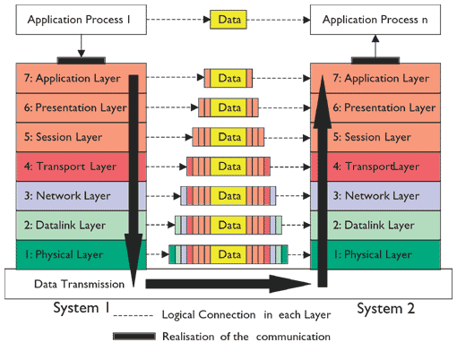

# Network Communication and Identification

Short description

## Definitions

These abbreviations are used in the text.

| Abbreviation | Definition                                    |
| ------------ | --------------------------------------------- |
| IP           | Internet Protocol                             |
| DHCP         | Dynamic Host Configuration Protocol           |
| DNS          | Domain Name System                            |
| ISP          | Internet Service Provider                     |
| OSI          | Open Systems Interconnection                  |
| ISO          | Internation Origanisation for Standardization |
| TCP          | Transmission Control Protocol                 |
| UDP          | User Datagram Protocol                        |
| MAC          | Media Access Control                          |
| NIC          | Network Interface Controller                  |
| OUI          | Organizational Unique Identifiers             |
| CIDR         | Classless Inter-Domain Routing                |

**Protocol**:

- An established **set of rules** that determine how data is **transmitted** between different devices in the same network.

## Ip Adresses

### What are IP adresses?

In short an IP adress is a network adress for your computer so that the internet knows where data came from or to where it has to go to.

You can see it as your street adress, but for your computer.

Every device that is connected to the internet has a IP adress.

### Types of IP's

#### IPv4 *(32-bit)*

The most common type of IP adress is known as a IPv4 (version 4). An IPv4 consists of four numbers, each number is between **0** and **255** and gets delimited by a single dot.

```js
140.82.121.4
```

#### IPv6 *(128-bit)*

The new IP adress is IPv6 (version 6). An IPv6 consists of 8 groups that consist of 4 hexadecimal *[`0123456789abcdef`]* digits and is delimited by a colon.

```py
2a00:1450:400e:0800:0000:0000:0000:200e
```

But an IPv6 has some different notation rules. It can omit leading zeros.

```py
2a00:1450:400e:800:0:0:0:200e
```

And a double colon can be used to replace a series of zeroes, for example.

```py
2a00:1450:400e:800::200e
```

### What happens if we run out of IPs?

It has already happend, since and IPv4 can only have around 4.3 billion unique IP adresses we ran out. The IPv4 format wasn't designed for the amount of IPs that get used today. 

Fortunately there is IPv6 which can handle enough IPs for the future. *(Hopefully?)* *[IPv6 max: `340,282,366,920,938,463,463,374,607,431,768,211,456`]*

#### How do I get my IP?

**DHCP** is something your **ISP** uses to provide IPs to its hosts. *(Hosts are devices/users)*

#### If we use IPs to visit the internet how can I just type example.com?

The **DNS** servers handle this, these have records that contain the domain and the corresponding IP adress. *(This includes subdomains)*

## PORTs

Since you only have one IP adress to communicate on the internet you would not be able to let multiple services connect to the internet at the same time with the same IP as that the data that gets received from the internet would have no idea to which program it has to go. Thats why they invented PORTS, a port is basically a way for your computer to know to where it has to send the received data. And yes thats not a mistake, it says computer. As a port is on layer 3 or 4 on the OSI model it doesn't get opened by the first layer. 

In short, ports are a way to let your computer have multiple services communicating on the internet at once.

#### Privileged ports and protocols

| Port     | Abbreviation | Definition                          |
| -------- | ------------ | ----------------------------------- |
| 21       | FTP          | File Transfer Protocol              |
| 22       | SSH          | Secure Shell                        |
| 23       | Telnet       | Telnet                              |
| 25       | SMTP         | Simple Mail Transfer Protocol       |
| 53       | DNS          | Domain Name System                  |
| 67, 68   | DHCP         | Dynamic Host Configuration Protocol |
| 69       | TFTP         | Trivial File Transfer Protocol      |
| 80       | HTTP         | Hypertext Transfer Protocol         |
| 110      | POP3         | Post Office Protocol                |
| 139, 445 | SMB          | Server Message Block                |
| 143      | IMAP         | Internet Message Access Protocol    |
| 161      | SNMP         | Simple Network Management Protocol  |
| 443      | HTTPS        | Hyper Text Transfer Protocol Secure |

## The OSI model

The OSI model is an ISO standardized refference model for datacommunication. In the OSI model every step is seperated by layers and this is the same for all networks and applications. The seventh layer (application) its data does not impact the other layers, as each layer has their tasks and they don't interfear with other layers. As the arrows show in the image, the data gets packed and unpacked to send data from the first application to the second.



## The two main network protocols

The **TCP** and **UDP** network protocols are the most used protocols for tranmitting packets over the internet, there are some core differences between these two protocols.

**TCP**:

- **Ensures** that packages got delived succesfully

- **Buffers** to prevent missing data

**UDP**:

- Does **not ensure** that packets got delived succesfully

- **Very fast** as it doesn't check if the tramission was succesfull

## MAC Adress

A MAC adress is a **unique network identifier** that is assigned to a NIC. MAC adresses consist of 6 groups that consist of 2 hexadecimal digits and is *(generally)* delimited by a dash.

```py
B0-6E-BF-5D-ED-E1
```

The first three bytes are OUI's,  they represent the manufacter of the NIC. And the last three bytes identify the particular card from that manufacturer.

## Subnetting

A subnet is a subnetwork that follows the IP. Subnetting means the splitting up a set of consecutive IP addresses for addressing on separate physical networks.

### Subnet Mask Sheet

| Hosts           | 128     | 64      | 32      | 16      | 8       | 4       | 2       | 1       |
|:---------------:|:-------:|:-------:|:-------:|:-------:|:-------:|:-------:|:-------:|:-------:|
| **Subnet Mask** | **128** | **192** | **244** | **240** | **248** | **252** | **254** | **255** |

The hosts is just the lasts iteration devided by two starting from 128. And the subnet is the last host and the current host.

### Subnet Sheet

| Subnet Mask | 128           | 192           | 224          | 240         | 248         | 252        | 254        | 255        |
|:-----------:|:-------------:|:-------------:|:------------:|:-----------:|:-----------:|:----------:|:----------:|:----------:|
| Subnet      | X.0.0.0       |               |              |             |             |            |            |            |
| **CIDR**    | **/1**        | **/2**        | **/3**       | **/4**      | **/5**      | **/6**     | **/7**     | **/8**     |
| **Hosts**   | 2 147 483 648 | 1 073 741 824 | 536  870 912 | 268 435 456 | 134 217 728 | 67 108 864 | 33 554 432 | 16 777 216 |
| Subnet      | 255.X.0.0     |               |              |             |             |            |            |            |
| **CIDR**    | **/9**        | **/10**       | **/11**      | **/12**     | **/13**     | **/14**    | **/15**    | **/16**    |
| **Hosts**   | 8 388 608     | 4 194 304     | 2 097 152    | 1 048 576   | 524 288     | 262 144    | 131 072    | 65 636     |
| Subnet      | 255.255.X.0   |               |              |             |             |            |            |            |
| **CIDR**    | **/17**       | **/18**       | **/19**      | **/20**     | **/21**     | **/22**    | **/23**    | **/24**    |
| **Hosts**   | 32 768        | 16 384        | 8 192        | 4 096       | 2 048       | 1 024      | 512        | 256        |
| Subnet      | 255.255.255.X |               |              |             |             |            |            |            |
| **CIDR**    | **/25**       | **/26**       | **/27**      | **/28**     | **/29**     | **/30**    | **/31**    | **/32**    |
| **Hosts**   | 128           | 64            | 32           | 16          | 8           | 4          | 2          | 1          |


